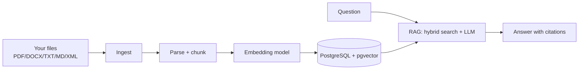

# User Guide

Step-by-step: how to run and use the RAG Research Assistant Bot.

## 0. Big picture



## 1. Prerequisites (once)

- **Java 21** — `java -version` shows 21.x
- **Docker Desktop** — `docker --version`
- **OpenRouter key** — https://openrouter.ai/keys
- *(optional)* **LM Studio** — local chat/embeddings, no cloud

## 2. Infrastructure

```bash
docker compose up -d
```

| Container | Port | Purpose |
|-----------|------|---------|
| rag-postgres (pgvector) | 5432 | vectors + metadata |
| rag-ollama | 11434 | local embeddings (only if `app.embedding.provider=ollama`) |
| rag-adminer | 8081 | DB web UI (optional) |

First run downloads images (postgres+pgvector ~600 MB, ollama several GB) — that takes
time, the app is not hung. Verify with `docker ps`.

## 3. Credentials

```bash
cp .env.example .env
```

Edit `.env` and set `OPENROUTER_API_KEY=sk-or-...`.

## 4. Profiles

`SPRING_PROFILES_ACTIVE` (comma-separated) selects interfaces:

| Profile | Provides |
|---------|----------|
| `rest`  | REST API on `/api/*` |
| `webui` | chat web page on `http://localhost:8080` |
| `telegram` | Telegram bot (needs `TELEGRAM_BOT_TOKEN`) |
| `cli`   | interactive console |

Default: `rest,webui`.

## 5. Run

```bash
./gradlew bootRun
```

Success looks like:

```
Tomcat started on port 8080 (http) with context path '/'
Started RagAssistantApplication in 5.2 seconds
```

## 6. Web UI

1. Open http://localhost:8080
2. Click **Choose files** and pick **several** documents (PDF, DOCX, TXT, MD, XML).
3. Click **Upload** — status shows «N/M ingested».
4. Type a question and press **Send**. The bot answers with cited sources.

## 7. REST via curl (PowerShell)

> In PowerShell, `curl` is an alias for `Invoke-WebRequest`. Always use `curl.exe` and put
> JSON in a **file** to avoid 500 errors.

Bulk upload:

```powershell
curl.exe -s -F "files=@./a.pdf" -F "files=@./b.docx" -F "files=@./c.xml" http://localhost:8080/api/documents/bulk
```

Single upload:

```powershell
curl.exe -s -F "file=@./manual.pdf" http://localhost:8080/api/documents
```

Ask:

```powershell
Set-Content -Path chat.json -Value '{"message":"What is the refund policy?"}' -Encoding utf8
curl.exe -s -X POST http://localhost:8080/api/chat -H "Content-Type: application/json" -d "@chat.json"
```

## 8. CLI

```bash
SPRING_PROFILES_ACTIVE=cli ./gradlew bootRun
```

```
> upload ./a.pdf ./b.docx ./c.xml ./d.txt ./e.md
Ingested 5/5 file(s).
> ask What is the refund period?
...answer...
> exit
```

## 9. Telegram

```bash
SPRING_PROFILES_ACTIVE=rest,telegram TELEGRAM_BOT_TOKEN=12345:AA... ./gradlew bootRun
```

## 10. Switching providers

Embeddings (`app.embedding.provider`): `local` (default, no external service) | `ollama` |
`huggingface` | `openai` | `lmstudio`. Chat (`app.chat.provider`): `openrouter`
(`cohere/north-mini-code:free`) | `lmstudio`. Set via `application.yml` or env
`EMBEDDING_PROVIDER` / `CHAT_PROVIDER`. Changing embedding model changes the vector
dimension — recreate the `rag_embeddings` table afterwards.

## 11. Troubleshooting

| Symptom | Fix |
|---------|-----|
| `Port 8080 was already in use` | stop the old instance |
| Chat 500 «Unexpected error» | check `OPENROUTER_API_KEY`; send JSON via file (`@chat.json`) |
| «Unsupported file type» | only pdf/docx/txt/md/xml are allowed |
| «vector extension not found» | use the `pgvector/pgvector` image, not plain postgres |
| Switched embedding model, search empty | recreate `rag_embeddings` (dimension changed) |
