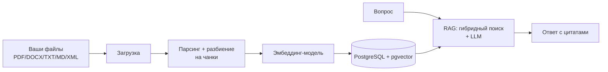
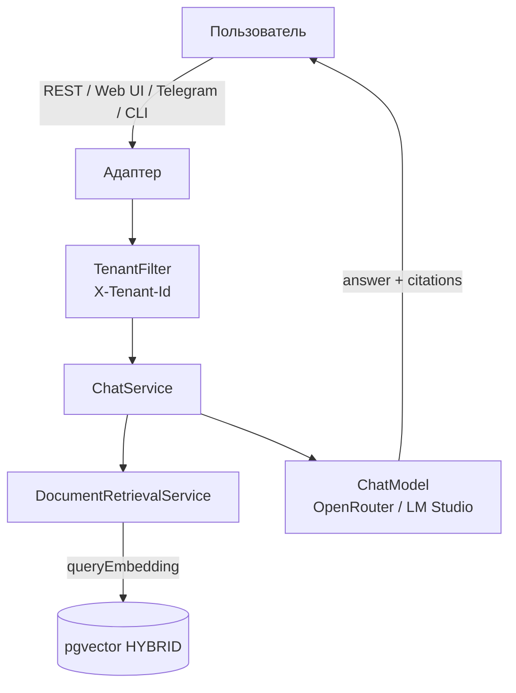

# Руководство пользователя (для самых маленьких)

Пошаговая инструкция, как запустить и использовать RAG Research Assistant Bot. Если раньше
казалось, что «приложение зависло» — скорее всего, просто Docker тянул образ (несколько
гигабайт) или curl отправлял невалидный JSON. Ниже всё разжёвано.

## 0. Что вообще происходит (картинка)





## 1. Что нужно установить (один раз)

| Что | Зачем | Как проверить |
|-----|-------|---------------|
| **Java 21** |运行时 приложения | `java -version` → 「21.x» |
| **Docker Desktop** | поднимает Postgres/pgvector | `docker --version` |
| **Ключ OpenRouter** | чат через LLM | взять на https://openrouter.ai/keys |
| *(опц.)* **LM Studio** | локальный чат/эмбеддинги без облака | запустить, загрузить модель |

Скачать Java: https://adoptium.net (выберите Temurin 21 LTS). Docker:
https://www.docker.com/products/docker-desktop.

## 2. Инфраструктура (база данных)

В папке проекта выполните:

```bash
docker compose up -d
```

Поднимутся контейнеры:

| Контейнер | Порт | Зачем |
|-----------|------|-------|
| `rag-postgres` (pgvector) | 5432 | хранит векторы и метаданные документов |
| `rag-ollama` | 11434 | локальные эмбеддинги (нужен, только если `app.embedding.provider=ollama`) |
| `rag-adminer` | 8081 | веб-интерфейс к БД (необязателен) |

> Первый раз Docker **скачает образы** (postgres+pgvector ~600 МБ, ollama — несколько ГБ).
> Это займёт время — приложение ещё не «зависло», просто идёт загрузка. Проверьте:
> `docker ps` (должны быть статусы «Up»).

Остановить: `docker compose down`. Удалить данные: `docker compose down -v`.

## 3. Ключ доступа

Скопируйте шаблон и впишите ключ OpenRouter:

```bash
cp .env.example .env
```

Откройте `.env` и замените `OPENROUTER_API_KEY=sk-or-...` на свой ключ. Без него чат не
сработает (загрузка документов — сработает, она от ключа не зависит при `local`-эмбеддингах).

## 4. Профили (самое важное)

Приложение может работать в разных режимах. Они включаются переменной
`SPRING_PROFILES_ACTIVE` (через запятую):

| Профиль | Что даёт |
|---------|----------|
| `rest`  | REST API на `/api/*` |
| `webui` | веб-страница чата на `http://localhost:8080` |
| `telegram` | Telegram-бот (нужен `TELEGRAM_BOT_TOKEN`) |
| `cli`   | интерактивная консоль |

По умолчанию активны `rest,webui`.

## 5. Запуск приложения

Откройте терминал **в папке проекта** и выполните (Windows — `.\gradlew.bat`):

```bash
./gradlew bootRun
```

Что увидите в консоли (признак успеха):

```
Tomcat started on port 8080 (http) with context path '/'
Started RagAssistantApplication in 5.2 seconds
```

Если видите это — **всё запустилось**. Если порт 8080 занят — остановите мешающий
процесс или поменяйте порт в `application-rest.yml` (`server.port`).

## 6. Веб-интерфейс (проще всего)

1. Откройте браузер: http://localhost:8080
2. Нажмите **Choose files** (кнопка выбора файлов) и выберите **несколько** документов
   сразу (PDF, DOCX, TXT, MD, XML).
3. Нажмите **Upload** — статус покажет «N/M ingested».
4. Внизу в поле ввода задайте вопрос по загруженным документам и нажмите **Send**.
5. Бот вернёт ответ и укажет источники (файлы), из которых взял информацию.

## 7. REST API через curl (PowerShell)

> В PowerShell встроенный `curl` — это алиас `Invoke-WebRequest` с другим синтаксисом.
> Всегда пишите `curl.exe` (с .exe) и кавычки в JSON кладите в **отдельный файл**, иначе
> получите 500 (именно из-за этого ранее падал чат).

**Массовая загрузка** (несколько файлов сразу):

```powershell
curl.exe -s -F "files=@./a.pdf" -F "files=@./b.docx" -F "files=@./c.xml" http://localhost:8080/api/documents/bulk
```

**Одиночная загрузка:**

```powershell
curl.exe -s -F "file=@./manual.pdf" http://localhost:8080/api/documents
```

**Вопрос к боту** (сначала создайте файл `chat.json`):

```powershell
Set-Content -Path chat.json -Value '{"message":"What is the refund policy?"}' -Encoding utf8
curl.exe -s -X POST http://localhost:8080/api/chat -H "Content-Type: application/json" -d "@chat.json"
```

Ответ — JSON с полями `answer` и `citations`.

## 8. Консоль (CLI)

Запуск в режиме консоли:

```bash
SPRING_PROFILES_ACTIVE=cli ./gradlew bootRun
```

Команды:

```
> upload ./a.pdf ./b.docx ./c.xml ./d.txt ./e.md
Ingested 5/5 file(s).
> ask What is the refund period?
...ответ...
> exit
```

## 9. Telegram-бот

```bash
SPRING_PROFILES_ACTIVE=rest,telegram TELEGRAM_BOT_TOKEN=12345:AA... ./gradlew bootRun
```

В Telegram просто пишите боту вопрос — он ответит по вашим документам. Для изоляции
собеседников укажите `app.telegram.allowed-chat-ids`.

## 10. Смена провайдеров

Эмбеддинги (`app.embedding.provider`): `local` (по умолч., без внешних сервисов) |
`ollama` | `huggingface` | `openai` | `lmstudio`.

Чат (`app.chat.provider`): `openrouter` (модель `cohere/north-mini-code:free`) |
`lmstudio` (локально).

Меняются в `application.yml` или через переменные окружения `EMBEDDING_PROVIDER`,
`CHAT_PROVIDER`. Смена эмбеддинг-модели меняет размерность — после этого пересоздайте
таблицу `rag_embeddings` (или используйте свежую БД).

## 11. Частые проблемы

| Симптом | Решение |
|---------|---------|
| `Port 8080 was already in use` | остановите старый инстанс (`Stop-Process` по PID из `Get-NetTCPConnection -LocalPort 8080`) |
| Чат возвращает 500 с «Unexpected error» | проверьте `OPENROUTER_API_KEY` и что JSON отправлен через файл (`@chat.json`) |
| Загрузка падает с «Unsupported file type» | используйте только pdf/docx/txt/md/xml |
| «vector extension not found» | контейнер должен быть `pgvector/pgvector`, а не чистый postgres |
| Меняли эмбеддинг-модель — поиск пустой | пересоздайте таблицу `rag_embeddings` (размерность изменилась) |
